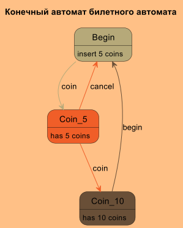
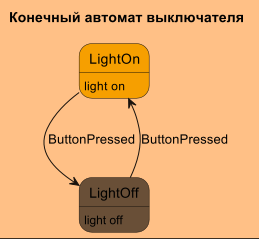
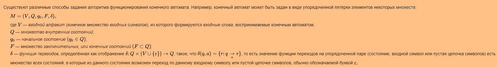

# Конечный автомата State Machine

Если дать неформальное определение конечного автомата то,
 конечный автомат это - конечный набор состояний и парил перехода между этими состояниями.

## В проекте

### Конечный автомат билетного аппарата

### Конечный автомат парсера новостной ленты

Пример html страницы которую будет парсить взят отсюда [Центр раскрытия](https://www.e-disclosure.ru/vse-novosti)

**Дисклеймер**
HTML сам по себе регулярным языком не является по этому конечным автоматом его не распарсить,
однако мы в рамках задачи мы работаем не с html а с ограниченным набором символов, которые
будем отслеживать в виде строк файла. Поэтому мы будим считать что язык с которам мы работаем регулярный
и на основании этого мы применяем конечный детерминированный автомат.

На всей странице нам нужно найти div c id="cont_wrap", в нем из тегов div c class="listitem" берем текст новости,
из div с class="time" берем время. После парсинга страницы у нас на выходе должен быть список
с датами и названиями новостей.

Состояния конечного автомата будут соответствовать тегам в html файле:

- BEGIN
- CONT_WRAP
- TIME
- LIST_ITEM
- LIST_ITEM_END

## Теория

**Абстрактный автомат** — это математическая абстрактная модель дискретного устройства,
имеющего один вход и один выход, в каждый момент находится в одном состоянии из множества возможных.
 Частным случаем этой теории являются автоматы Мура и Мили.

Если входное событие или символ однозначно определяет переход, иными словами из любого состояния
по любому символу возможен переход не более, чем в одно состояние,
то такой автомат называется **детерминированным**.
(Из одного состояния возможен переход только в одно состояние)
Если возможен переход произвольным образом или используется ранее накопленные данные для перехода,
например из стека, то автомат называется **недетерменированным**.
(Из одного состояния возможен переход только в несколько состояний)

## Пример конечного автомата

Конечный автомат выключателя

## Использованные материалы

- [Конечный автомат wikipedia](https://ru.wikipedia.org/wiki/%D0%9A%D0%BE%D0%BD%D0%B5%D1%87%D0%BD%D1%8B%D0%B9_%D0%B0%D0%B2%D1%82%D0%BE%D0%BC%D0%B0%D1%82)
- [Конечные автоматы](https://ps-group.github.io/compilers/fsm)